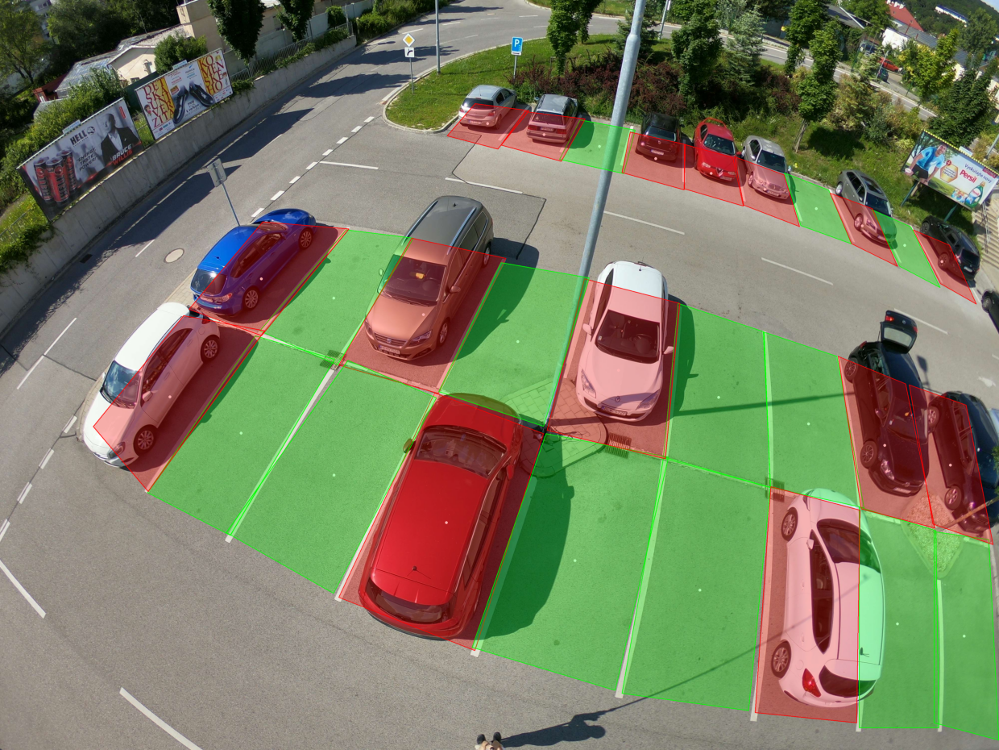
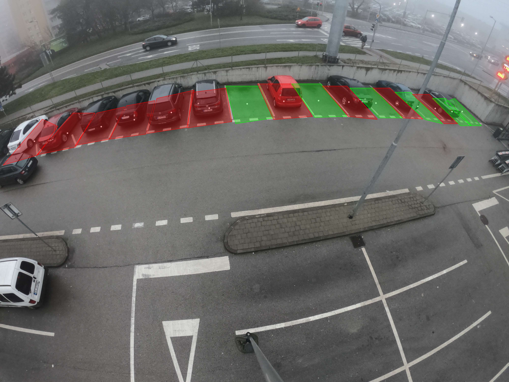

# Parking Spots Detection

A system for detecting vacant and occuied parking spots using YOLOv11 segmentation and clustering.




## Dataset

- **Source:** [Dataset Link](https://www.kaggle.com/datasets/silenceo0/parkinglotsaugmented)
- **Size:** 1,270 annotated images for training and 298 for validation
- **Format:** YOLO segmentation (`class x1 y1 x2 y2 ...`)
- **Classes:** Vacant, Occupied
- **Augmentations:**
  - Horizontal flip
  - Rotating
  - Brightness adjustment
  - Scaling
  - Cropping

## Model

YOLOv11m-seg (for instance segmentation) was trained on the custom dataset of parking spots.

### Training Details

- **Epochs:** 100  
- **Batch Size:** 8  
- **Image Size:** 960  
- Other hyperparameters were kept at their default values.

## Clustering

A custom clustering method groups parking spots into blocks. Clusters with only one or two spots are considered noise and ignored. The algorithm works like DBSCAN, using BFS to find nearby spots without a fixed distance parameter. Distances depend on the size of the spots, which helps handle different spacing caused by camera perspective.

## Installation

```bash
git clone https://github.com/Silence-o0/ParkingLotsDetection
cd ParkingLotsDetection
pip install -r requirements.txt
````

## Usage

### Detect from webcam (live stream)

```bash
python detect_parking.py --source stream
```

### Detect from an image or videofile

```bash
python detect_parking.py --source path/to/file
```

### Flags

* `--source`

  * Use `stream` for webcam input  
  * Or provide a file path for an image or video

* `--output`

  * Optional. Path to save the result (only for image or video input)

* `--plot`

  * Optional. Set to `True` to display the image with overlay (ignored for stream input). Default is `False`

